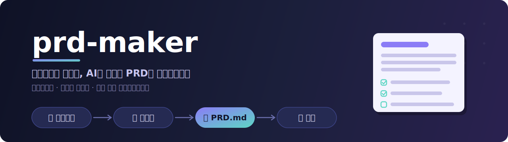

<div align="center">

**한국어** · [English](README.md)



<br/>

[](https://github.com/jcmaker/prd-maker/actions/workflows/ci.yml)
[](LICENSE)


[](https://github.com/jcmaker/prd-maker/pulls)

**아이디어를 말하면, AI 코딩 에이전트가 그대로 실행할 수 있는 `PRD.md`를 만들어주는 플러그인 (Claude Code · Codex).**

</div>

무언가를 만들려고 할 때 가장 중요한 건 시작점의 문서, 즉 PRD(제품 요구사항 문서)입니다. 그런데 AI 에이전트에게 일을 시키는 시대의 PRD는 사람끼리 합의하던 예전 PRD와 다릅니다. prd-maker는 그 "에이전트용 PRD 잘 쓰는 법"을 인터뷰와 템플릿 안에 녹여, **비개발자도 질문에 답하기만 하면** 좋은 PRD가 나오게 합니다.

---

## 목차

- [왜 필요한가](#왜-필요한가)
- [에이전트용 PRD는 뭐가 다른가](#에이전트용-prd는-뭐가-다른가)
- [작동 방식](#작동-방식)
- [적응형 인터뷰](#적응형-인터뷰)
- [만들어지는 PRD의 구조](#만들어지는-prd의-구조)
- [구조 린터](#구조-린터)
- [설치](#설치)
- [사용법](#사용법)
- [다른 에이전트에서 쓰기 (Codex · Cursor)](#다른-에이전트에서-쓰기-codex--cursor)
- [실제 예시](#실제-예시)
- [설계 철학](#설계-철학)
- [자주 묻는 질문](#자주-묻는-질문)
- [로드맵](#로드맵)
- [라이선스](#라이선스)

---

## 왜 필요한가

AI 코딩 에이전트는 강력하지만, **모호한 지시를 받으면 그럴듯하게 틀립니다.** "북마크 정리 앱 만들어줘"라고 하면 에이전트는 인증을 넣을지 뺄지, 데이터를 어디 저장할지, 무엇을 이번 버전에서 제외할지를 전부 **스스로 추측**합니다. 그리고 그 추측은 보통 당신이 원한 것과 다릅니다.

좋은 PRD는 이 추측을 없앱니다. 하지만 좋은 PRD를 쓰는 일 자체가 어렵습니다:

- 개발을 모르는 사람은 "기술 스택", "데이터 스키마" 같은 걸 물어도 답할 수 없습니다.
- 개발을 아는 사람도 **명시적 non-goals**, **기계 검증 가능한 수용 기준**, **페이즈 분할** 같은 에이전트 친화적 관행을 매번 챙기기 어렵습니다.
- 무엇을 물어야 하는지 아는 것부터가 전문 지식입니다.

prd-maker는 이 전문 지식을 대신 갖고 있습니다. 당신은 아이디어만 던지면 되고, 나머지는 인터뷰가 끌어냅니다.

## 에이전트용 PRD는 뭐가 다른가

전통적 PRD는 사람이 읽고 행간을 채웠습니다. 에이전트는 행간을 채우지 못합니다 — 정확히는, 채우긴 하는데 잘못 채웁니다. 그래서 에이전트용 PRD에는 세 가지가 반드시 들어가야 합니다.

| 원칙 | 이유 |
|---|---|
| **명시적 Non-Goals** | 에이전트는 "언급 안 함"을 "제외"로 해석하지 못합니다. "인증은 구현하지 않는다"라고 **적어야** 인증을 안 만듭니다. |
| **기계 검증 가능한 수용 기준** | "빠르게"는 판단 불가. "첫 화면 3초 이내"는 통과/실패가 명확. |
| **페이즈 분할** | 프론티어 LLM도 한 번에 따를 수 있는 지시는 150~200개 수준. 요구사항을 페이즈로 쪼개야 품질이 유지됩니다. |

prd-maker가 만드는 PRD는 이 세 가지를 구조적으로 강제합니다. 게다가 문서 맨 위에 **에이전트를 위한 지침 헤더**(불명확하면 추측 말고 질문하라, 구현 중 결정이 바뀌면 문서를 갱신하라)를 넣어, PRD가 살아있는 source of truth로 기능하게 합니다.

## 작동 방식

```
당신의 아이디어
      │
      ▼
┌───────────────────────────────────────────────┐
│  /prd-maker                                     │
│                                                 │
│  0. 듣기      아이디어를 자유롭게 말한다           │
│      │                                          │
│  1. 인터뷰    기술 수준 감지 → 8요소를             │
│      │        한 번에 하나씩 채운다 (≤10문항)      │
│  2. 확인      3~5줄 요약 → 사용자 확인            │
│      │                                          │
│  3. 작성      7섹션 PRD 초안 생성                │
│      │                                          │
│  4. 검증      구조 린터(결정론적) + 의미 셀프리뷰    │
│      │        → PRD.md 저장                      │
└──────┼──────────────────────────────────────────┘
       ▼
   PRD.md  ──►  아무 AI 코딩 에이전트에게 "이대로 구현해줘"
```

내부 구조는 **점진적 공개(progressive disclosure)** 원칙을 따릅니다. 얇은 오케스트레이터(`SKILL.md`, 45줄)가 흐름을 지휘하고, 각 단계에서 필요한 참조 문서만 그때그때 불러옵니다:

```
prd-maker/
├── skills/prd-maker/
│   ├── SKILL.md                  # 오케스트레이터: 4단계 워크플로우 + 엣지 케이스
│   ├── references/
│   │   ├── interview-guide.md     # (1단계) 수준 감지 + 8요소 커버리지 + 질문 전략
│   │   ├── prd-template.md        # (3단계) 7섹션 구조 + 작성 규칙 + 스켈레톤
│   │   └── quality-rules.md       # (4단계) 산출 직전 의미 셀프리뷰
│   └── scripts/
│       └── validate_prd.py        # (4단계) 구조 린터 (결정론적, 언어 무관)
├── commands/prd-maker.md          # /prd-maker 슬래시 커맨드 (Claude Code)
├── .claude-plugin/                # Claude Code 플러그인 + 셀프 마켓플레이스
├── .codex-plugin/                 # Codex 플러그인 매니페스트
└── .agents/plugins/               # Codex 마켓플레이스
```

스킬 콘텐츠(`skills/`)는 한 벌뿐이고, 그 위에 각 도구의 얇은 포장(`.claude-plugin/`, `.codex-plugin/`)만 얹혀 있습니다.

이렇게 나눈 이유는 단순합니다 — 한 번에 모든 지시를 컨텍스트에 밀어넣으면 수행 품질이 떨어지기 때문입니다. 인터뷰할 때는 인터뷰 규칙만, PRD 쓸 때는 템플릿만 봅니다.

## 적응형 인터뷰

인터뷰의 핵심은 **당신의 기술 수준을 감지해서 질문의 어휘를 바꾸는 것**입니다. 별도의 퀴즈 없이, 첫 발화에서 추정합니다.

- **개발자 트랙** — "React로", "API 크롤링", "Postgres에 저장" 같은 표현이 나오면 스택·배포 환경·기존 코드베이스를 **직접** 묻습니다.
- **비개발자 트랙** — "앱 같은 거", "사람들이 가입하는 사이트" 같은 제품 언어만 나오면 기술 질문을 **하지 않습니다.** 대신 "폰에서 쓰나요, 컴퓨터에서 쓰나요?" 수준으로 묻고, 기술 결정은 답변에서 **근거와 함께 합리적 기본값을 도출**해 PRD에 `(가정)`으로 기록합니다.

트랙은 *무엇을 묻느냐*만 바꿉니다. *PRD에 무엇이 들어가야 하느냐*는 바뀌지 않습니다.

인터뷰는 아래 **8개 필수 요소**를 커버리지 체크리스트로 관리합니다. 첫 발화에서 이미 답한 건 건너뛰고, 빈 것만 우선순위 순서로 하나씩 묻습니다.

| # | 요소 | 무엇을 끌어내나 |
|---|---|---|
| 1 | 문제 | 왜 이걸 만드는가 (에이전트가 모호할 때 판단 근거로 씀) |
| 2 | 대상 사용자 | 누가, 어떤 상황에서 쓰는가 |
| 3 | 핵심 기능 (3~7) | 무엇을 하는가 |
| 4 | Non-goals | 이번 버전에서 **빼는** 것 (사용자가 안 꺼내면 후보를 제시해 확인) |
| 5 | 성공 기준 | 뭐가 되면 "됐다"인가 |
| 6 | 기술 제약 | 스택·배포·데이터 (트랙별로 깊이 조절) |
| 7 | 우선순위 | 무엇부터 동작해야 하나 (페이즈 순서가 됨) |
| 8 | 데이터/콘텐츠 | 어떤 정보를 다루나 |

규칙 몇 가지:

- **한 메시지에 질문 하나.** 몰아치지 않습니다.
- **선택지가 있으면 객관식.** 답하기 쉽게.
- **총 10문항 이하.** 우선순위 낮은 빈칸은 기본값 + `(가정)`으로 채웁니다.
- **"모르겠어요"** 에는 추천 하나를 근거와 함께 제시하고 동의 여부만 묻습니다.
- **이미 답한 건 다시 안 묻습니다.**

## 만들어지는 PRD의 구조

산출물은 **단일 `PRD.md`**, 7개 섹션입니다. 특정 도구 문법(CLAUDE.md, .cursorrules 등)을 쓰지 않는 **순수 마크다운**이라 Claude Code·Cursor·Codex 등 어떤 에이전트에게든 그대로 넣을 수 있습니다.

| 섹션 | 내용 | 핵심 규칙 |
|---|---|---|
| **1. 개요** | 문제·목표 2~3문장 | "왜"를 반드시 포함 |
| **2. 대상 사용자 & JTBD** | 누가/언제/무엇을 이루려고 | — |
| **3. 핵심 기능 (스코프)** | 기능별 한 문단 | 우선순위 순 정렬 |
| **4. Non-Goals** | 이번 버전에서 하지 않는 것 | 양성 진술, 최소 3개 |
| **5. 기술 제약 & 기존 결정** | 스택·배포·데이터 | 비개발자 기본값은 근거 병기, 확정은 `[변경 금지]` |
| **6. 페이즈별 요구사항** | 목표 + 번호 요구사항 + 체크박스 수용 기준 | 각 페이즈는 동작하는 결과로 종료 (no dead ends) |
| **7. 성공 지표** | 측정 가능한 형태 | 미정이면 `(가정)` |

문서 맨 위에는 항상 에이전트용 지침 헤더가 붙습니다:

> **AI 에이전트에게:** 이 문서는 구현 지침입니다. 불명확한 부분은 추측하지 말고 사용자에게 질문하세요. 구현 중 결정이 바뀌면 이 문서를 갱신해 source of truth로 유지하세요. `(가정)` 표시 항목은 사용자가 확인하지 않은 내용이니, 의존하기 전에 사용자에게 확인하세요.

## 구조 린터

LLM의 셀프리뷰는 유용하지만, "7개 섹션이 다 있는가", "non-goals가 3개 이상인가", "수용 기준이 체크박스 형식인가" 같은 **결정론적** 검사는 매번 똑같이 통과해야 신뢰할 수 있습니다. 그래서 이런 구조 검사는 코드가 맡습니다.

`scripts/validate_prd.py`(파이썬 표준 라이브러리만 사용, 언어 무관)가 PRD를 저장하기 직전에 5가지를 검사합니다:

1. 에이전트 지침 헤더(blockquote)가 존재하는가
2. `## 1.`~`## 7.` 섹션이 순서대로 하나씩 있는가
3. Non-goals가 3개 이상인가
4. 각 페이즈에 수용 기준 체크박스가 있는가
5. 페이즈당 요구사항이 50개 이하인가

그리고 모든 `(가정)`/`(assumption)` 항목을 줄 번호와 함께 뽑아줍니다. 실패하면 스킬이 고쳐서 재검사하고, 통과(exit 0)해야 저장합니다. 코드 펜스 안의 예시는 오탐하지 않도록 무시하며, 의미 판단("직관적인 UI가 모호한가")은 여전히 사람과 LLM의 몫으로 남깁니다.

린터는 독립 실행도 됩니다:

```bash
python3 skills/prd-maker/scripts/validate_prd.py PRD.md
```

## 설치

### Claude Code

Claude Code에서 마켓플레이스를 추가하고 설치합니다:

```
/plugin marketplace add jcmaker/prd-maker
/plugin install prd-maker@prd-maker
```

터미널 CLI로도 가능합니다:

```bash
claude plugin marketplace add jcmaker/prd-maker
claude plugin install prd-maker@prd-maker
```

로컬 체크아웃에서 개발·수정하며 쓰려면 디렉토리를 소스로 등록하세요. 이 경우 파일을 고친 뒤 `claude plugin update prd-maker`로 반영합니다:

```bash
git clone https://github.com/jcmaker/prd-maker.git
claude plugin marketplace add ./prd-maker
claude plugin install prd-maker@prd-maker
```

설치 후 `/prd-maker`가 슬래시 커맨드 목록에 나타나면 준비 완료입니다.

### Codex

이 저장소는 Codex 플러그인(`.codex-plugin/`)으로도 패키징되어 있습니다. Codex에서 저장소를 열면 스킬이 발견되며 `$prd-maker` 또는 `/skills`로 호출합니다. 자세한 건 아래 [다른 에이전트에서 쓰기](#다른-에이전트에서-쓰기-codex--cursor)를 참고하세요.

## 사용법

빈 프로젝트 디렉토리에서 커맨드를 실행하면 인터뷰가 시작됩니다:

```
/prd-maker
```

아이디어를 바로 붙여서 0단계를 건너뛸 수도 있습니다:

```
/prd-maker 동네 러닝 크루 모임 앱을 만들고 싶어
```

인터뷰가 끝나면 현재 디렉토리에 `PRD.md`가 생성됩니다. 그다음은:

```
# 새 Claude Code 세션 (또는 다른 AI 코딩 도구)에서
이 PRD대로 구현해줘
```

에이전트는 PRD의 페이즈 순서대로, 되묻지 않고 구현을 시작합니다. `(가정)` 항목이 남아 있으면 그것만 먼저 확인합니다.

## 다른 에이전트에서 쓰기 (Codex · Cursor)

스킬 콘텐츠(`SKILL.md` + `references/` + `scripts/`)는 특정 도구에 묶이지 않은 **오픈 Agent Skills 표준**을 따릅니다. 그래서 Claude Code 외의 에이전트에서도 같은 인터뷰·PRD 생성이 동작합니다.

**Codex** — 이 저장소는 Codex 플러그인으로도 패키징되어 있습니다 (`.codex-plugin/plugin.json` + `.agents/plugins/marketplace.json`). Codex는 저장소를 열면 `skills/` 아래의 스킬을 발견하며, `$prd-maker` 또는 `/skills`로 호출하거나 아이디어를 설명하면 자동으로 켜집니다. 산출물과 린터는 Claude Code에서와 동일합니다.

**Cursor · 그 외** — Agent Skills를 네이티브로 지원하는 도구(Gemini CLI, Copilot 등)는 스킬 디렉토리에 배치하면 되고, 그렇지 않은 도구에서는 에이전트에게 **"`skills/prd-maker/SKILL.md`를 읽고 그대로 따라 인터뷰한 뒤 `PRD.md`를 만들어줘"** 라고 지목하면 됩니다. 자동 트리거만 없을 뿐, 인터뷰·PRD 작성·구조 린터(`scripts/validate_prd.py`, 표준 라이브러리만 사용)까지 전부 동작합니다.

> 산출되는 `PRD.md`는 애초에 순수 마크다운이라 **어느 에이전트에 넣든 100% 그대로** 쓸 수 있습니다. 크로스-에이전트는 "PRD를 만드는 쪽"에도 적용될 뿐, "PRD를 소비하는 쪽"은 처음부터 범용이었습니다.

## 실제 예시

"Next.js랑 Supabase로 북마크 정리 SaaS 만들려고 해. 크롬 확장으로 저장하고 웹에서 태그 관리"로 시작한 인터뷰가 만든 PRD의 일부입니다.

**인터뷰 흐름 (개발자 트랙, 총 8문항):**

```
Q1. 이걸 만들려는 이유가 궁금해요. 지금 북마크 정리에서 어떤 불편을 겪고 계신가요?
Q2. 핵심 기능에 추가로 필요한 게 있을까요? (폴더, 자동 태깅, 썸네일 …)
Q3. 이번 범위에서 제외할 것들을 확인할게요. (결제 / 팀 공유 / 타 브라우저 …)
Q4. 뭐가 되면 "됐다"고 느끼실까요?
Q5. 인증은 어떻게? (공개 가능성 고려하면 처음부터 로그인을 추천드려요)
Q6. 배포는 어디에? (Next.js면 Vercel, 확장은 Chrome Web Store 가정할까요?)
Q7. 하나부터 만든다면 무엇부터? (저장 파이프라인 vs 웹 UI)
Q8. 북마크 하나당 저장할 정보를 확인할게요. (URL, 제목, 설명, 파비콘 …)
```

**산출된 PRD 발췌:**

```markdown
## 4. Non-Goals (하지 않는 것)

- 이번 버전에서 AI 기반 자동 태깅 제안은 구현하지 않는다. (추후 버전 후보)
- 이번 버전에서 결제/유료 플랜은 구현하지 않는다.
- 이번 버전에서 팀 공유·협업 기능은 구현하지 않는다.
- 이번 버전에서 크롬 외 다른 브라우저 확장은 지원하지 않는다.
- 이번 버전에서 폴더/컬렉션 기반 분류는 구현하지 않는다 (태그로 대체).

## 6. 페이즈별 요구사항

### Phase 1: 저장 파이프라인 (확장 → DB)
**목표:** 크롬 확장에서 저장한 북마크가 Supabase DB에 정상적으로 쌓인다.
**수용 기준:**
- [ ] 로그인 후 확장 아이콘 클릭 → 저장 버튼까지 2클릭 이내로 도달한다.
- [ ] 저장 완료 시 bookmarks 테이블에 url, title, description, favicon_url 레코드가 1건 생성된다.
- [ ] 같은 URL을 다시 저장하면 레코드가 중복 생성되지 않고 기존 레코드가 갱신된다.
```

비개발자가 같은 방식으로 "동네 러닝 크루 모임 앱"을 말하면, 스택 질문은 한 번도 나오지 않고 기술 제약이 근거와 함께 `(가정)`으로 자동 기록됩니다.

## 설계 철학

prd-maker는 "기능을 최대한 넣자"가 아니라 **"이득이 증명된 것만 넣자"** 로 만들어졌습니다. 프롬프트 자산은 지시가 많아질수록 수행 품질이 떨어지기 때문입니다.

- **판단은 마크다운, 결정론은 코드.** 인터뷰·PRD 작성·의미 검증처럼 판단이 필요한 일은 지침으로, 구조 검사처럼 매번 같아야 하는 일은 스크립트로 나눴습니다.
- **사용자 언어를 따라갑니다.** 한국어로 인터뷰하면 한국어 PRD가 나옵니다. 스킬 내부 지침만 영어로 쓰여 있습니다(공개 배포 관례).
- **작게 시작합니다.** v1은 "인터뷰 → PRD 생성"에만 집중합니다. 사전 리서치나 구현 자동화는 실사용 피드백을 본 뒤에 붙입니다.

이 원칙들의 근거는 공개된 에이전트 PRD 연구에서 왔습니다:

- [Addy Osmani — How to write a good spec for AI agents](https://addyosmani.com/blog/good-spec/)
- [How to write PRDs for AI Coding Agents](https://medium.com/@haberlah/how-to-write-prds-for-ai-coding-agents-d60d72efb797)
- [Writing PRDs for AI Code Generation Tools in 2026](https://www.chatprd.ai/learn/prd-for-ai-codegen)
- [Anthropic — Equipping agents with Agent Skills](https://www.anthropic.com/engineering/equipping-agents-for-the-real-world-with-agent-skills)

## 자주 묻는 질문

**개발을 전혀 몰라도 쓸 수 있나요?**
네. 그게 핵심 설계 목표입니다. 기술 용어 질문은 개발자 트랙에서만 나오고, 비개발자에게는 제품 수준 질문만 합니다. 기술 결정은 스킬이 근거와 함께 채워 `(가정)`으로 표시하니, 나중에 검토하거나 에이전트가 확인하게 하면 됩니다.

**Claude Code 전용인가요?**
아니요. Claude Code와 Codex 플러그인으로 패키징되어 있고(둘 다 오픈 Agent Skills 표준을 씀), Cursor 등 다른 도구에서도 스킬을 지목해 쓸 수 있습니다. 자세한 건 [다른 에이전트에서 쓰기](#다른-에이전트에서-쓰기-codex--cursor)를 보세요. 그리고 **산출되는 PRD는 순수 마크다운**이라 어떤 AI 코딩 도구에도 그대로 넣을 수 있습니다.

**`(가정)` 표시는 왜 있나요?**
사용자가 직접 확인하지 않은 내용과, 스킬이 합리적으로 추론한 기본값을 구분하기 위해서입니다. 이렇게 하면 나중에 무엇을 검토해야 하는지가 명확하고, 구현 에이전트도 어디를 재확인해야 하는지 압니다.

**질문이 너무 많거나 적으면요?**
총 10문항을 넘지 않도록 설계돼 있습니다. 답을 짧게 하거나 지치면, 남은 빈칸을 기본값 + `(가정)`으로 채우고 "가정이 많으니 검토해달라"고 안내합니다.

**아이디어가 너무 크면요?**
독립적인 서브시스템이 여럿(예: 채팅 + 결제 + 분석)이면 인터뷰 초반에 감지해서 "v1은 가장 핵심 조각 하나로 좁히자"고 제안합니다. 전체를 고집하면 나머지는 Non-goals의 "후속 버전"으로 밀어냅니다.

**이미 `PRD.md`가 있으면 덮어쓰나요?**
아니요. 새 파일로 만들지, 기존 문서를 읽고 갱신할지 물어봅니다.

## 로드맵

v1은 의도적으로 작게 유지했습니다. 실사용 피드백에 따라 검토할 후속 후보:

- **작성 전 자동 리서치** — 유사 제품·기술 실현 가능성을 웹서치로 검증해 PRD에 반영
- **구현 핸드오프** — 페이즈별 태스크 분해와 구현 지시 프롬프트까지 생성
- **PRD 갱신 모드** — living document를 구현 중 유지하도록 보조

## 라이선스

MIT — 자유롭게 쓰고, 고치고, 배포하세요.
