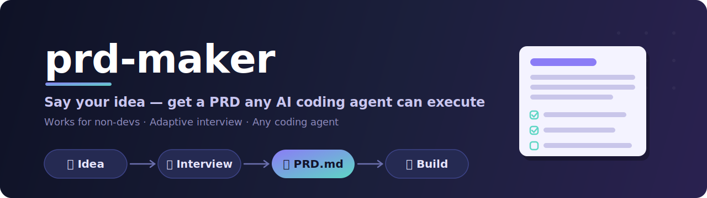

<div align="center">

[한국어](README.ko.md) · **English**



<br/>

[](https://github.com/jcmaker/prd-maker/actions/workflows/ci.yml)
[](LICENSE)


[](https://github.com/jcmaker/prd-maker/pulls)

**Say your idea out loud, get a `PRD.md` any AI coding agent can execute — a plugin for Claude Code · Codex.**

</div>

The most important document when you build something is the one at the very start: the PRD (product requirements document). But in the age of AI coding agents, a good PRD looks different from the ones humans used to align with each other. prd-maker bakes the "how to write a PRD an agent can actually execute" know-how into an interview and a template, so that **even non-developers get a good PRD just by answering questions.**

---

## Table of contents

- [Why it exists](#why-it-exists)
- [What makes an agent PRD different](#what-makes-an-agent-prd-different)
- [How it works](#how-it-works)
- [The adaptive interview](#the-adaptive-interview)
- [The PRD it produces](#the-prd-it-produces)
- [The structure linter](#the-structure-linter)
- [Install](#install)
- [Usage](#usage)
- [Using it in other agents (Codex · Cursor)](#using-it-in-other-agents-codex--cursor)
- [A real example](#a-real-example)
- [Design philosophy](#design-philosophy)
- [FAQ](#faq)
- [Roadmap](#roadmap)
- [License](#license)

---

## Why it exists

AI coding agents are powerful, but **when the instruction is vague, they fail convincingly.** Tell one "build a bookmark app" and it decides on its own whether to add auth, where to store data, and what to leave out of this version — and those guesses are usually not what you had in mind.

A good PRD removes the guessing. But writing one is itself hard:

- People who don't code can't answer "what's your tech stack?" or "what's your data schema?"
- People who do code still find it hard to consistently apply agent-friendly practices — **explicit non-goals**, **machine-verifiable acceptance criteria**, **phased scope**.
- Knowing *what to ask* is expertise in the first place.

prd-maker holds that expertise for you. You bring the idea; the interview draws out the rest.

## What makes an agent PRD different

Traditional PRDs were read by humans who filled in the gaps. Agents don't fill gaps — or rather, they fill them wrong. So an agent PRD must carry three things:

| Principle | Why |
|---|---|
| **Explicit non-goals** | An agent can't read "not mentioned" as "excluded." You have to **write** "auth is out of scope" for it to skip auth. |
| **Machine-verifiable acceptance criteria** | "Fast" can't be judged. "First screen within 3s" passes or fails. |
| **Phased scope** | Even frontier LLMs reliably follow only ~150–200 instructions at once. Split requirements into phases to keep quality up. |

The PRD prd-maker produces enforces all three structurally. It also puts an **instruction header for agents** at the top (don't guess — ask; update this doc when a decision changes mid-build), so the PRD works as a living source of truth.

## How it works

```
your idea
      │
      ▼
┌───────────────────────────────────────────────┐
│  /prd-maker                                     │
│                                                 │
│  0. Listen    describe what you want to build   │
│      │                                          │
│  1. Interview detect skill level → fill the     │
│      │        8-element checklist (<=10 Qs)     │
│  2. Confirm   3–5 line summary → you confirm    │
│      │                                          │
│  3. Draft     generate the 7-section PRD        │
│      │                                          │
│  4. Verify    structure linter + semantic check │
│      │        → save PRD.md                      │
└──────┼──────────────────────────────────────────┘
       ▼
   PRD.md  ──►  hand to any AI coding agent: "build this"
```

The internals follow **progressive disclosure**. A thin orchestrator (`SKILL.md`, 45 lines) runs the flow and pulls in only the reference it needs at each step:

```
prd-maker/
├── skills/prd-maker/
│   ├── SKILL.md                  # orchestrator: 4-step workflow + edge cases
│   ├── references/
│   │   ├── interview-guide.md     # (step 1) level detection + 8-element coverage
│   │   ├── prd-template.md        # (step 3) 7-section structure + rules + skeleton
│   │   └── quality-rules.md       # (step 4) pre-delivery semantic self-review
│   └── scripts/
│       └── validate_prd.py        # (step 4) structure linter (deterministic, language-agnostic)
├── commands/prd-maker.md          # /prd-maker slash command (Claude Code)
├── .claude-plugin/                # Claude Code plugin + self-marketplace
├── .codex-plugin/                 # Codex plugin manifest
└── .agents/plugins/               # Codex marketplace
```

There's one copy of the skill content (`skills/`); each tool's thin packaging (`.claude-plugin/`, `.codex-plugin/`) sits on top. The reason for splitting: pushing every instruction into context at once degrades performance. During the interview it only reads interview rules; while writing the PRD it only reads the template.

## The adaptive interview

The heart of the interview is **detecting your technical level and changing the vocabulary of the questions.** No quiz — it's inferred from your first message.

- **Developer track** — words like "in React," "crawl an API," "store in Postgres" → it asks directly about stack, deployment, and existing codebase.
- **Non-developer track** — product-only language like "an app kind of thing" → it asks **no** technical questions. Instead it asks "phone or computer?" level questions and derives sensible technical defaults **with rationale**, recording them in the PRD as `(assumption)`.

The track only changes *what it asks*. It never changes *what the PRD must contain.*

The interview manages these **8 required elements** as a coverage checklist. Anything your first message already answered is skipped; only the gaps are asked, one at a time, in priority order.

| # | Element | What it draws out |
|---|---|---|
| 1 | Problem | why you're building it (the agent uses this to resolve ambiguity) |
| 2 | Target user | who uses it, in what situation |
| 3 | Core features (3–7) | what it does |
| 4 | Non-goals | what's **excluded** this version (if you don't raise it, it proposes candidates) |
| 5 | Success criteria | what "done" feels like |
| 6 | Technical constraints | stack · deployment · data (depth by track) |
| 7 | Priority | what must work first (becomes the phase order) |
| 8 | Data/content | what information the product handles |

A few rules:

- **One question per message.** No dumping.
- **Multiple choice when the options are enumerable.** Easy to answer.
- **10 questions max.** Low-priority gaps get filled with defaults marked `(assumption)`.
- **"I don't know"** gets one recommendation with a one-line reason, and only asks for a yes/no.
- **It never re-asks what you already said.**

## The PRD it produces

The output is a **single `PRD.md`**, seven sections. It's **pure markdown** with no tool-specific syntax (no CLAUDE.md / .cursorrules conventions), so you can hand it to Claude Code, Cursor, Codex, or any agent as-is.

| Section | Content | Key rule |
|---|---|---|
| **1. Overview** | problem · goal in 2–3 sentences | must include the "why" |
| **2. Target users & JTBD** | who / when / trying to accomplish what | — |
| **3. Core features (scope)** | one paragraph per feature | ordered by priority |
| **4. Non-goals** | what's not being done this version | positive statements, min. 3 |
| **5. Technical constraints & prior decisions** | stack · deploy · data | non-dev defaults carry rationale; fixed ones tagged `[DO NOT CHANGE]` |
| **6. Phased requirements** | goal + numbered requirements + checkbox acceptance criteria | each phase ends runnable (no dead ends) |
| **7. Success metrics** | measurable form | `(assumption)` if undecided |

An agent-instruction header always sits at the top:

> **For AI agents:** This document is your implementation instruction. Where it is unclear, do not guess — ask the user. When a decision changes during implementation, update this document to keep it the source of truth. Items marked `(assumption)` were not confirmed by the user — verify before relying on them.

## The structure linter

LLM self-review is useful, but deterministic checks — "are all 7 sections present," "are there at least 3 non-goals," "are acceptance criteria in checkbox form" — need to pass identically every time to be trustworthy. So those structural checks are handled by code.

`scripts/validate_prd.py` (Python stdlib only, language-agnostic) runs five checks right before the PRD is saved:

1. the agent-instruction header (blockquote) exists
2. sections `## 1.`–`## 7.` are present, once each, in order
3. there are at least 3 non-goals
4. each phase has acceptance-criteria checkboxes
5. each phase has at most 50 requirements

It also lists every `(가정)`/`(assumption)` item with its line number. On failure the skill fixes and re-runs; it only saves once the linter exits 0. Examples inside code fences are ignored so they don't cause false positives, and semantic judgment ("is 'intuitive UI' too vague") stays with the human and the LLM.

The linter runs standalone too:

```bash
python3 skills/prd-maker/scripts/validate_prd.py PRD.md
```

## Install

### Claude Code

Add the marketplace and install:

```
/plugin marketplace add jcmaker/prd-maker
/plugin install prd-maker@prd-maker
```

Or from the terminal CLI:

```bash
claude plugin marketplace add jcmaker/prd-maker
claude plugin install prd-maker@prd-maker
```

To develop against a local checkout, register the directory as a source and apply edits with `claude plugin update prd-maker`:

```bash
git clone https://github.com/jcmaker/prd-maker.git
claude plugin marketplace add ./prd-maker
claude plugin install prd-maker@prd-maker
```

Once `/prd-maker` shows up in your slash-command list, you're ready.

### Codex

This repo is also packaged as a Codex plugin (`.codex-plugin/`). Codex discovers the skill under `skills/` when you open the repo; invoke it with `$prd-maker` or `/skills`. See [Using it in other agents](#using-it-in-other-agents-codex--cursor) below.

## Usage

Run the command in an empty project directory to start the interview:

```
/prd-maker
```

Or paste your idea to skip step 0:

```
/prd-maker I want to build a bookmark-organizing app for my neighborhood running crew
```

When the interview ends, a `PRD.md` is created in the current directory. Then:

```
# in a fresh Claude Code session (or any other AI coding tool)
build this PRD
```

The agent starts implementing in phase order without re-asking. If any `(assumption)` items remain, it verifies just those first.

## Using it in other agents (Codex · Cursor)

The skill content (`SKILL.md` + `references/` + `scripts/`) follows the tool-agnostic **open Agent Skills standard**, so the same interview and PRD generation work in agents beyond Claude Code.

**Codex** — this repo is packaged as a Codex plugin (`.codex-plugin/plugin.json` + `.agents/plugins/marketplace.json`). Codex discovers the skill under `skills/` when you open the repo; invoke it with `$prd-maker` or `/skills`, or just describe your idea and it activates. The output and linter are identical to Claude Code.

**Cursor and others** — tools with native Agent Skills support (Gemini CLI, Copilot, …) pick it up when placed in their skills directory. For tools without it, just point the agent at it: **"read `skills/prd-maker/SKILL.md` and follow it to interview me, then produce `PRD.md`."** Only the auto-trigger is missing — the interview, PRD writing, and structure linter (`scripts/validate_prd.py`, stdlib only) all work.

> The `PRD.md` it produces is pure markdown from the start, so it drops into **any agent, 100% as-is**. Cross-agent support applies to the *producing* side too — the *consuming* side was universal from day one.

## A real example

Here's part of a PRD produced from an interview that started with "I want to build a bookmark-organizing SaaS with Next.js and Supabase — save via a Chrome extension, manage tags on the web."

**Interview flow (developer track, 8 questions):**

```
Q1. What's driving this? What's the pain in organizing bookmarks today?
Q2. Any features to add? (folders, auto-tagging, thumbnails …)
Q3. Let's confirm what's out of scope. (payments / team sharing / other browsers …)
Q4. What would make you feel it's "done"?
Q5. How about auth? (given you may open it up, I'd suggest login from the start)
Q6. Where will it deploy? (Next.js → Vercel, extension → Chrome Web Store?)
Q7. If you build one thing first, which? (save pipeline vs web UI)
Q8. Let's confirm what to store per bookmark. (URL, title, description, favicon …)
```

**Excerpt from the produced PRD:**

```markdown
## 4. Non-Goals

- AI-based auto-tagging suggestions are not implemented in this version. (future candidate)
- Payments/paid plans are not implemented in this version.
- Team sharing/collaboration is not implemented in this version.
- Browsers other than Chrome are not supported in this version.
- Folder/collection-based classification is not implemented (tags cover it).

## 6. Phased Requirements

### Phase 1: Save pipeline (extension → DB)
**Goal:** bookmarks saved from the Chrome extension land correctly in Supabase.
**Acceptance criteria:**
- [ ] After login, extension icon → save button is reachable in 2 clicks.
- [ ] On save, one record with url, title, description, favicon_url appears in the bookmarks table.
- [ ] Re-saving the same URL updates the existing record instead of duplicating.
```

If a non-developer describes the same idea, no stack question ever appears and the technical constraints get filled in automatically, each marked `(assumption)` with its rationale.

## Design philosophy

prd-maker was built on **"add only what's proven to help,"** not "cram in as many features as possible" — because prompt assets get worse as instructions pile up.

- **Judgment in markdown, determinism in code.** Work that needs judgment (interview, PRD writing, semantic review) lives in instructions; work that must be identical every time (structure checks) lives in a script.
- **It follows the user's language.** Interview in Korean and you get a Korean PRD. Only the skill's internal instructions are in English (public-distribution convention).
- **It starts small.** v1 focuses on "interview → PRD generation." Pre-research and implementation automation come after real usage feedback.

The rationale comes from published research on agent PRDs:

- [Addy Osmani — How to write a good spec for AI agents](https://addyosmani.com/blog/good-spec/)
- [How to write PRDs for AI Coding Agents](https://medium.com/@haberlah/how-to-write-prds-for-ai-coding-agents-d60d72efb797)
- [Writing PRDs for AI Code Generation Tools in 2026](https://www.chatprd.ai/learn/prd-for-ai-codegen)
- [Anthropic — Equipping agents with Agent Skills](https://www.anthropic.com/engineering/equipping-agents-for-the-real-world-with-agent-skills)

## FAQ

**Can non-developers really use it?**
Yes — that's the core design goal. Technical questions only appear on the developer track; non-developers get product-level questions. Technical decisions are filled in with rationale and marked `(assumption)`, so you can review them later or let the implementing agent verify them.

**Is it Claude Code only?**
No. It's packaged as both a Claude Code and a Codex plugin (both use the open Agent Skills standard), and you can point other tools like Cursor at the skill. See [Using it in other agents](#using-it-in-other-agents-codex--cursor). And the **produced PRD is pure markdown**, so it drops into any AI coding tool as-is.

**Why the `(assumption)` marks?**
To separate what the user actually confirmed from defaults the skill reasoned out. That makes it clear what to review later, and tells the implementing agent where to double-check.

**What if there are too many or too few questions?**
It's designed to stay at 10 questions max. If you answer tersely or get tired, it fills the remaining gaps with defaults marked `(assumption)` and tells you the PRD is assumption-heavy and needs review.

**What if the idea is too big?**
If there are several independent subsystems (e.g. chat + payments + analytics), it detects that early and proposes narrowing v1 to the single most essential piece. If you insist on everything, the rest is pushed into Non-goals as "future version."

**Will it overwrite an existing `PRD.md`?**
No. It asks whether to create a new file or read and update the existing one.

## Roadmap

v1 is deliberately small. Candidates to consider based on real usage feedback:

- **Pre-write research** — validate similar products and technical feasibility via web search and fold it into the PRD
- **Implementation handoff** — generate phase-by-phase task breakdowns and implementation prompts
- **PRD update mode** — help keep the living document current during implementation

## License

MIT — use it, change it, distribute it freely.
